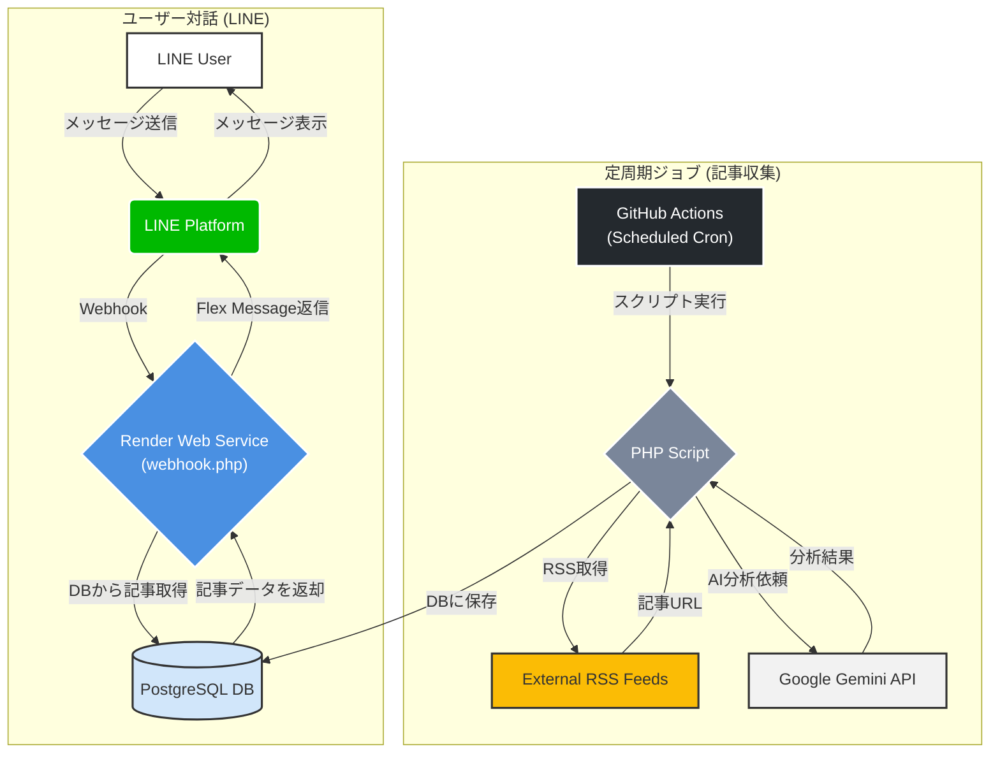
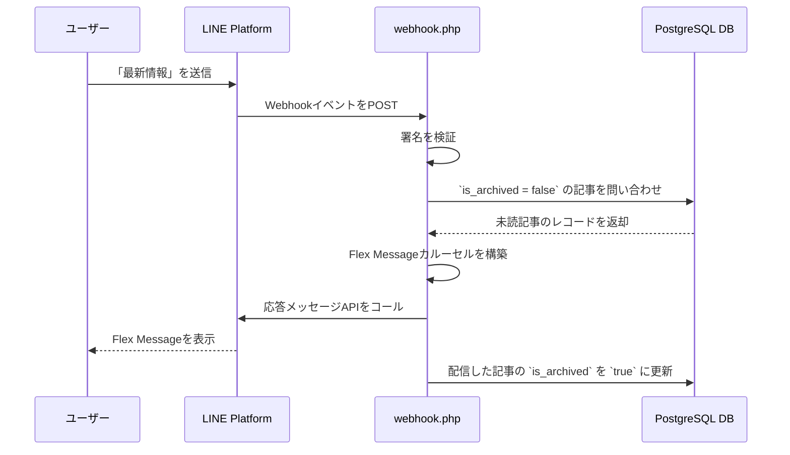

# 設計書 (統合版)

## 1. 概要

このプロジェクトは、開発者向けの技術記事をLINEで自動配信するBotです。RSSフィードから最新記事を収集し、Gemini APIによるAI分析（要約、タグ付け、クイズ生成）を行い、リッチなFlex Messageとしてユーザーに届けます。記事データはPostgreSQLデータベースで管理され、未読記事の段階的配信やキーワード検索が可能です。

## 2. 主な機能

-   **RSSフィードからの自動記事収集**: `config/feeds.php` で設定されたRSSフィードから定期的に最新記事を取得します。
-   **AIによる記事分析**: Gemini APIを利用して、記事の要約、関連タグの抽出、内容に関する三択クイズを自動生成します。
-   **LINE Flex Message**: 記事のタイトル、要約、タグ、クイズを、視覚的に分かりやすいリッチなメッセージで配信します。
-   **データベースによる記事管理**: 記事データはPostgreSQLに保存され、効率的に管理されます。
-   **未読記事の段階的配信**: 「`最新情報`」というメッセージで、未読の記事を最大10件ずつ配信します。
-   **キーワード検索**: 「`最新情報 [キーワード]`」という形式で、過去記事の検索が可能です。
-   **インタラクティブなクイズ機能**: 記事内容に関するクイズに、ボタンをタップして直感的に回答できます。
-   **カスタマイズ可能なリッチメニュー**: トーク画面下部のメニューを、専用スクリプトで簡単に設定・更新できます。

## 3. 技術スタック

-   **言語**: PHP 8.2
-   **Webサーバー**: Apache
-   **データベース**: PostgreSQL
-   **LINE API**: Messaging API
-   **AI**: Google Gemini API
-   **ホスティング**: Render (Web Service & Database)
-   **CI/CD & 定期実行**: GitHub Actions
-   **コンテナ技術**: Docker

## 4. システム構成図



## 5. セットアップと運用

### 5.1. セットアップガイド

#### 1. リポジトリのクローン

```bash
git clone https://github.com/your-username/your-repository-name.git
cd your-repository-name
```

#### 2. Renderでのサービス準備

1.  **PostgreSQLデータベースの作成**: Renderのダッシュボードで新規にPostgreSQLデータベースを作成し、「**Internal Connection String**」をコピーします。
2.  **Web Serviceのデプロイ**: このGitHubリポジトリを元に、Renderで新しい「Web Service」を作成し、ランタイムとして「Docker」を選択します。

#### 3. 環境変数の設定

作成したWeb Serviceの「Environment」タブで、以下の環境変数を設定します。GitHub Actionsでも同様のシークレット設定が必要です。

| キー                      | 説明                                                              |
| ------------------------- | ----------------------------------------------------------------- |
| `DATABASE_URL`            | 手順2-1でコピーしたPostgreSQLの内部接続URL。                      |
| `LINE_CHANNEL_ACCESS_TOKEN` | Messaging APIのチャネルアクセストークン。 |
| `LINE_CHANNEL_SECRET`     | チャネルシークレット。                 |
| `AI_API_KEY`              | Gemini APIのAPIキー。                 |
| `SCRAPING_API_KEY`        | [Browserless.io](https://www.browserless.io/)のAPIキー（任意）。 |
| `LINE_USER_ID`            | テスト通知を受け取るあなたのLINEユーザーID（任意）。                |

#### 4. リッチメニューの設定

1.  `richmenu.png` を作成し、プロジェクトのルートに配置してpushします。
2.  GitHubのActionsタブから「Send LINE Notification」ワークフローを手動実行し、`setup_rich_menu` を選択して実行します。

#### 5. 定期実行の設定 (GitHub Actions)

1.  GitHubリポジトリの「Settings」->「Secrets and variables」->「Actions」で、手順3の環境変数をすべてシークレットとして登録します。
2.  Actionsタブから `daily_notify` を手動実行し、動作確認します。成功すれば、スケジュールに従って自動実行が開始されます。

### 5.2. 運用・メンテナンス

#### 【重要】無料データベースの90日更新手順

Renderの無料PostgreSQLは**90日で自動的に削除される**ため、サービスを継続するには90日ごとの手動更新が必要です。

**作業タイミング**: データベース作成から85〜89日後を推奨します。

**手順の概要**:
1.  **新しいDBを作成**: Renderで新しいPostgreSQLデータベースを作成します。
2.  **接続情報をコピー**: 新しいDBの「Internal Connection String」をコピーします。
3.  **(推奨) データ移行**: `pg_dump` と `psql` を使い、古いDBから新しいDBへデータを移行します。
    ```bash
    pg_dump "古いDBのExternal Connection String" | psql "新しいDBのExternal Connection String"
    ```
4.  **Web Serviceを更新**: RenderのWeb Serviceの環境変数 `DATABASE_URL` を新しいものに更新します。
5.  **GitHub Actionsを更新**: GitHubリポジトリのSecret `DATABASE_URL` を新しいものに更新します。
6.  **DBを初期化**: GitHub Actionsで `daily_notify` を手動実行し、新しいDBにテーブルを作成します。
7.  **(任意) 古いDBを削除**: Render上で古いデータベースを削除します。

## 6. 使い方とカスタマイズ

### 6.1. 使い方

-   **`最新情報`**: 未読の最新記事を最大10件表示します。
-   **`最新情報 [キーワード]`**: 記事をキーワード検索します。
-   **クイズの回答**: 記事と一緒に配信されるクイズにボタンで回答できます。

### 6.2. RSSフィードの追加・変更

`config/feeds.php` ファイルを編集することで、収集対象のRSSフィードを自由に追加・変更できます。

## 7. 制約とリスク管理

### 7.1. サービス上限とリスク

| サービス | リスク内容 | 深刻度 | 対策 |
| :--- | :--- | :--- | :--- |
| **Render** | **DBが90日で消滅する** | **高** | **本ドキュメント記載の手動更新 or 有料化** |
| **Render** | Web Serviceがスリープし、応答がタイムアウトする | 中 | 有料化 |
| **GitHub Actions** | 無料実行時間の上限（月2,000分） | 中 | スケジュール最適化 or 有料化 |
| **LINE API** | Pushメッセージの上限（月500通） | 低 | 機能追加時に注意 or 有料化 |

### 7.2. API・仕様の制約
- **ペイロードサイズ**: 一度の応答で送信する記事を10件に制限し、LINE APIの上限（50KB）を超えないように配慮しています。
- **データ長**: ポストバックアクションのデータ長などを考慮し、`webhook.php`内でテキストを`mb_substr`で短縮しています。
- **画像リソース**: リッチメニュー用画像のサイズ（1MB）や記事画像のURL長（2000文字）を検証しています。
- **入力トークン数**: Gemini APIに渡す記事本文を最大8000文字に制限しています。
- **タイムアウト**: 外部APIへのcURLリクエストには30秒のタイムアウトを設定しています。

## 8. コンポーネント詳細

| ファイル | 役割 |
| --- | --- |
| `public/webhook.php` | LINEからのWebhookを受信する公開エンドポイント。署名検証、ユーザーメッセージ処理、DBからのデータ取得、応答メッセージ送信を担当。 |
| `scripts/run_daily.php` | 日次実行されるバッチ処理。RSSを巡回し、記事をAIで分析してDBに保存する。 |
| `scripts/run_weekly.php` | 週次実行されるバッチ処理。AIで週間サマリーを生成して管理ユーザーに送信する。 |
| `scripts/setup_rich_menu.php` | LINEのリッチメニューを設定するための初回セットアップ用スクリプト。 |
| `src/lib.php` | 共通関数ライブラリ。DB接続、AI分析、LINEメッセージ送信などのコアロジックを内包。 |
| `config/feeds.php` | 収集対象のRSSフィードのリストを定義する設定ファイル。 |
| `schema.sql` | `articles`テーブルの構造を定義するSQLファイル。 |

## 9. データモデル

| カラム名 | 型 | 説明 |
| --- | --- | --- |
| `id` | SERIAL | 主キー。自動採番される記事ID。 |
| `source` | VARCHAR(50) | 記事の取得元フィード名。 |
| `title` | TEXT | 記事のタイトル。 |
| `url` | TEXT | 記事のユニークなURL。重複登録防止に使用。 |
| `summary` | TEXT | AIによる要約。 |
| `tags` | TEXT | AIによるタグ（カンマ区切り）。 |
| `quiz_question` | TEXT | AIによるクイズの問題文。 |
| `quiz_options` | TEXT | クイズの選択肢（JSON配列）。 |
| `quiz_correct_index` | INTEGER | クイズの正解のインデックス番号。 |
| `image_url` | TEXT | 記事のOGP画像などのURL。 |
| `published_at` | TIMESTAMPTZ | 記事の公開日時。 |
| `is_archived` | BOOLEAN | 配信済みかを示すフラグ。`true`なら新着としては配信されない。 |
| `flex_message_json` | TEXT | 配信するLINE Flex MessageのJSONデータ。 |
| `created_at` | TIMESTAMPTZ | レコード作成日時。 |

## 10. シーケンス図（新着情報取得）

