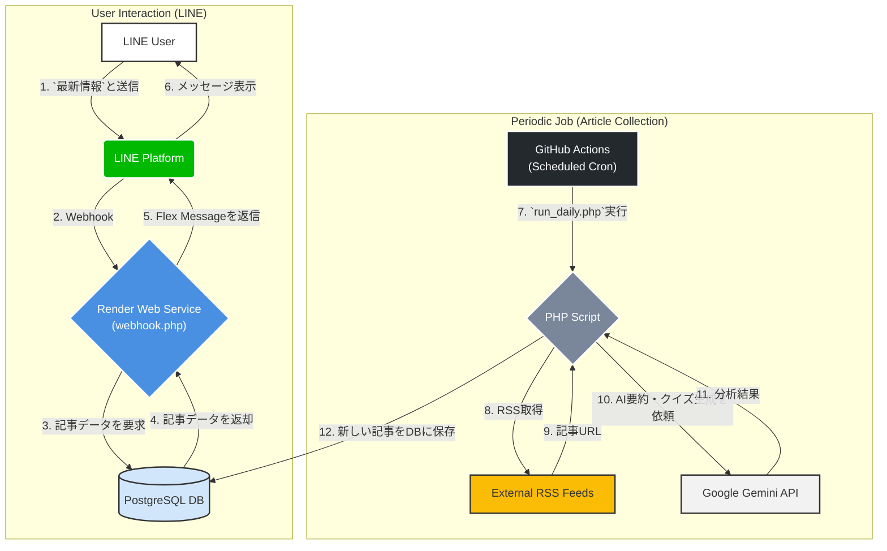

# LINE Bot for Developers

## 概要

このプロジェクトは、開発者向けの技術記事をLINEで自動配信するBotです。RSSフィードから最新記事を収集し、Gemini APIによるAI分析（要約、タグ付け、クイズ生成）を行い、リッチなFlex Messageとしてユーザーに届けます。記事データはPostgreSQLデータベースで管理され、未読記事の段階的配信やキーワード検索が可能です。

## 主な機能

-   **RSSフィードからの自動記事収集**: `config/feeds.php` で設定されたRSSフィードから定期的に最新記事を取得します。
-   **AIによる記事分析**: Gemini APIを利用して、記事の要約、関連タグの抽出、内容に関する三択クイズを自動生成します。
-   **LINE Flex Message**: 記事のタイトル、要約、タグ、クイズを、視覚的に分かりやすいリッチなメッセージで配信します。
-   **データベースによる記事管理**: 記事データはPostgreSQLに保存され、効率的に管理されます。
-   **未読記事の段階的配信**: 「`最新情報`」というメッセージで、未読の記事を最大10件ずつ配信します。
-   **キーワード検索**: 「`最新情報 [キーワード]`」という形式で、過去記事の検索が可能です。
-   **インタラクティブなクイズ機能**: 記事内容に関するクイズに、ボタンをタップして直感的に回答できます。
-   **カスタマイズ可能なリッチメニュー**: トーク画面下部のメニューを、専用スクリプトで簡単に設定・更新できます。

## 技術スタック

-   **言語**: PHP 8.2
-   **Webサーバー**: Apache
-   **データベース**: PostgreSQL
-   **LINE API**: Messaging API
-   **AI**: Google Gemini API
-   **ホスティング**: Render (Web Service)
-   **CI/CD & 定期実行**: GitHub Actions
-   **コンテナ技術**: Docker

---

## セットアップガイド

### 1. リポジトリのクローン

まず、このリポジトリをローカル環境にクローンします。

```bash
git clone https://github.com/your-username/your-repository-name.git
cd your-repository-name
```

### 2. Renderでのサービス準備

このBotは、LINEからのWebhookを常時待機する「Web Service」をRender上で実行します。

1.  **PostgreSQLデータベースの作成**
    -   Renderのダッシュボードで、新規にPostgreSQLデータベースを作成します（Freeプランで十分です）。
    -   作成後、データベースの詳細画面から「**Internal Connection String**」をコピーしておきます。これが`DATABASE_URL`になります。

2.  **Web Serviceのデプロイ**
    -   このGitHubリポジトリを元に、Renderで新しい「Web Service」を作成します。
    -   ランタイムとして「Docker」を選択します。Renderは自動的にプロジェクトルートの`Dockerfile`を認識し、ビルドします。

### 3. 環境変数の設定

作成したWeb Serviceの「Environment」タブで、以下の環境変数を設定します。後述するGitHub Actionsでも同様のシークレット設定が必要です。

| キー                      | 説明                                                              |
| ------------------------- | ----------------------------------------------------------------- |
| `DATABASE_URL`            | 手順2-1でコピーしたPostgreSQLの内部接続URL。                      |
| `LINE_CHANNEL_ACCESS_TOKEN` | LINE Developersで取得した、Messaging APIのチャネルアクセストークン。 |
| `LINE_CHANNEL_SECRET`     | LINE Developersで取得した、チャネルシークレット。                 |
| `AI_API_KEY`              | Google AI Studioで取得した、Gemini APIのAPIキー。                 |
| `SCRAPING_API_KEY`        | [Browserless.io](https://www.browserless.io/)のAPIキー（記事の本文取得精度向上、任意）。 |
| `LINE_USER_ID`            | テスト通知を受け取るあなたのLINEユーザーID（任意）。                |


### 4. データベースのテーブル作成

`run_daily.php`スクリプトは、`articles`テーブルが存在しない場合に自動で作成する機能を持っています。後述するGitHub Actionsを一度実行することで、テーブルが初期化されます。

### 5. リッチメニューの設定

ユーザーが最初に目にするリッチメニューを設定します。

1.  **画像ファイルの準備**
    -   `richmenu.png` というファイル名で、リッチメニューとして表示したい画像を作成します（推奨サイズ: 2500x1686px、1MB未満）。
    -   作成したファイルをプロジェクトのルートに配置し、コミット・プッシュします。

2.  **設定スクリプトの実行**
    -   GitHubリポジトリの「Actions」タブ -> 「Send LINE Notification」ワークフローを選択します。
    -   「Run workflow」ボタンを押し、表示されるドロップダウンから `setup_rich_menu` を選択して実行します。
    -   これにより、`richmenu.png`が読み込まれ、全ユーザーのデフォルトリッチメニューとして設定されます。

### 6. 定期実行の設定 (GitHub Actions)

記事の自動収集は、`.github/workflows/notify.yml` に定義されたGitHub Actionsによって行われます。

1.  **シークレットの登録**
    -   GitHubリポジトリの「Settings」->「Secrets and variables」->「Actions」を開きます。
    -   「New repository secret」ボタンを押し、手順3でリストアップした環境変数をすべて登録します。

2.  **動作確認**
    -   Actionsタブから「Send LINE Notification」ワークフローを手動実行（`daily_notify`を選択）し、ログにエラーが出ないことを確認します。
    -   成功すれば、スケジュールに従って毎日自動で記事が収集・分析され、データベースに保存されます。

---

## 使い方

LINE Botに以下のメッセージを送信することで、機能を呼び出せます。

-   **`最新情報`**
    未読の最新記事を最大10件、カルーセル形式で表示します。続けて送信すると、次の未読記事が表示されます。

-   **`最新情報 [キーワード]`**
    （例: `最新情報 PHP`）
    タイトルや要約にキーワードを含む記事を検索し、新しいものから最大10件表示します。

-   **クイズの回答**
    記事と共に配信されるクイズには、選択肢のボタンをタップして回答できます。正解・不正解がその場で分かります。

## カスタマイズ

### RSSフィードの追加・変更

`config/feeds.php` ファイルを編集することで、収集対象のRSSフィードを自由に追加・変更できます。

```php
<?php
// config/feeds.php

return [
    'publickey' => [
        'name' => 'publickey', // 内部識別名 (ユニークに)
        'label' => 'Publickey', // LINEで表示されるソース名
        'url' => 'https://www.publickey1.jp/atom.xml',
        'default_image_url' => 'https://www.publickey1.jp/about/images/publickey_logo_200.png', // サムネイルがない場合の代替画像
    ],
    // 他のフィードもこの形式で追加
];
```

---

## システム構成図

